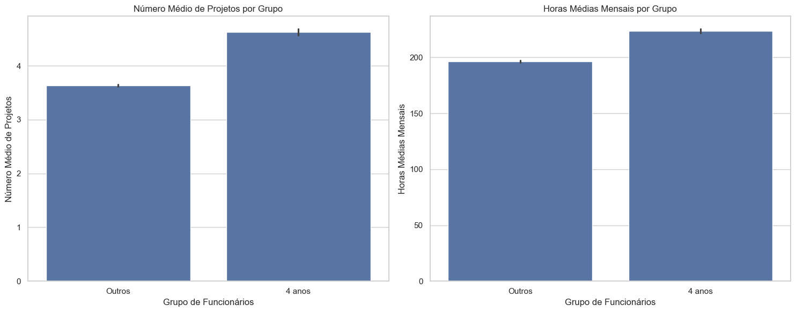
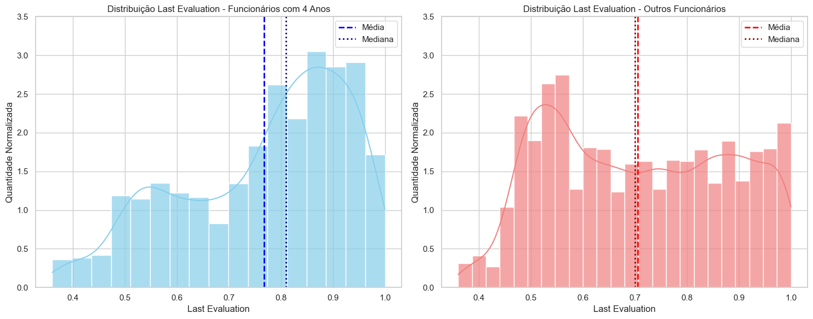
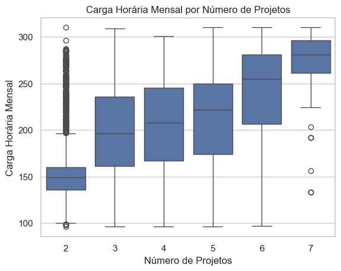
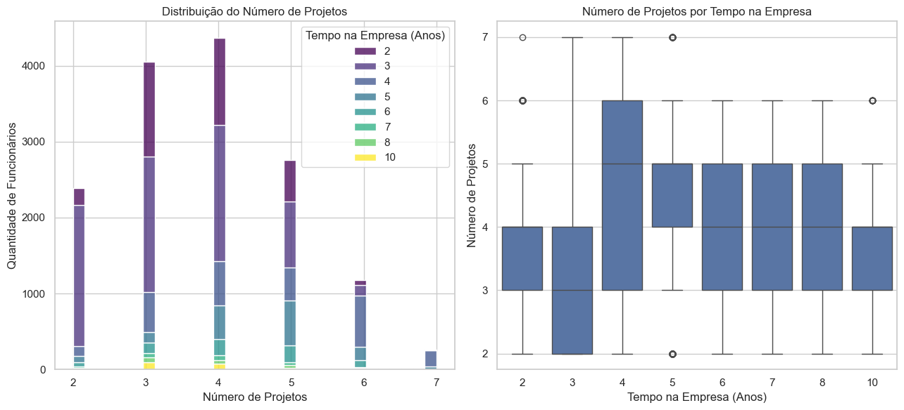

# Análise exploratória e previsão de retenção de Funcionários


```
Esse documento é composto pelas seguintes seções:

1. Contexto e Objetivo
2. Principais Descobertas
3. Recomendações
4. Impacto Esperado
```

## Objetivo 

Devido à preocupação com a satisfação e a alta rotatividade dos colaboradores, a empresa `Salifort Motors` decidiu realizar uma pesquisa interna. O objetivo principal é identificar pontos de melhoria no ambiente de trabalho e aumentar a capacidade de prever a retenção de funcionários. Com isso, a empresa busca agir preventivamente para evitar desligamentos, reduzindo custos com recrutamento, seleção e treinamento ao longo do tempo.

Este projeto visa analisar dados coletados dos colaboradores, identificar padrões relacionados à retenção e propor recomendações baseadas em evidências. Ao final, espera-se fornecer insights práticos que possam apoiar a tomada de decisão estratégica da empresa, promovendo um ambiente de trabalho mais saudável e sustentável.

## Estrutura dos dados

Cada linha do dataset representa um funcionário, com as seguintes colunas:
- `satisfaction_level`: Nível de satisfação do funcionário (0 a 1)
- `last_evaluation`: Avaliação do funcionário (0 a 1)
- `number_project`: Número de projetos do funcionário
- `average_montly_hours`: Média de horas trabalhadas no mês
- `time_spend_company`: Tempo de empresa do funcionário (anos)
- `Work_accident`: Se o funcionário sofreu um acidente de trabalho (0 ou 1)
- `left`: Se o funcionário deixou a empresa (0 ou 1)
- `promotion_last_5years`: Se o funcionário recebeu promoção nos últimos 5 anos (0 ou 1)
- `Department`: Departamento do funcionário
- `salary`: Faixa salarial do funcionário (low, medium, high)

## Considerações sobre os dados

Baseado nas informações, esse dataset é provavelmente resultado da união de fontes distintas, como `pesquisas de satisfação`, `avaliações de desempenho` e `registros de funcionários`, que podem vir de arquivos ou bancos de dados. Em um caso real, seria necessário um trabalho de integração e limpeza dos dados para que tal estrutura fosse alcançada com as informações necessárias.

Além disso, é fundamental garantir a privacidade e a segurança dos dados dos funcionários, em conformidade com a Lei Geral de Proteção de Dados (LGPD). Isso inclui a anonimização de informações pessoais e a adoção de práticas éticas no tratamento dos dados, assegurando que nenhum dado sensível ou identificador, como nomes ou IDs, esteja presente no dataset. O respeito à legislação e à ética é essencial para proteger os direitos dos colaboradores e manter a confiança no processo de análise.

## Tecnologias Utilizadas

```
Linguagem: 
Python

Bibliotecas:
- NumPy
- Pandas
- Matplotlib
- Seaborn
- Scikit-learn

IDE: 
Visual Studio Code
```


## Principais Descobertas Da Exploração

#### 1. Satisfação dos Funcionários

Foi percebido que funcionários com 4 anos de empresa apresentaram menor média de satisfação e também maior variabilidade na pontuação, e após esse período, a satisfação tende a aumentar. Então algo está acontecendo com esse grupo de funcionários que pode estar levando à insatisfação.


<br>

_Vamos investigar!_
<br>

Investigando mais a fundo esses funcionários, também viu-se que seus salários estão concentrados entre baixos/médios, o que pode indicar uma possível insatisfação com a remuneração.


Não é dito explicitamente as faixas de salários já que se tratam de dados fictícios, mas de forma geral o que se vê é que os funcionários com 4 anos de empresa aparentemente estão em uma faixa salarial que não condiz com suas expectativas ou com o mercado, o que pode levar à insatisfação e eventual desistência.

Mas o que poderia justificar o menor salário, talvez seja algumas das seguintes possibilidades:

- Carga menor de trabalho e menor atuação em projetos
- Menor pontuação de desempenho

Essas variáveis também foram investigadas:

_Carga de Trabalho:_


<br>

_Desempenho:_


Na verdade, o oposto foi encontrado. Funcionários com 4 anos de empresa estão trabalhando mais horas e participando de mais projetos, além de terem uma média/mediana de avaliação maior do que os demais grupos. 

Agora, vamos descobrir como é a rotatividade desses funcionários, em comparação aos demais, afinal no fim das contas eles pode não ser necessariamente os que mais geram rotatividade.


_Aqui usei uma métrica de rotatividade, que elimina a diferença na quantidade dos dois grupos, como uma forma de 'normalizar' a comparação._

E na verdade confirmando a premissa, de fato são o que mais geram rotatividade. Então muito provavelmente o que está acontecendo é que esses funcionários estão se sentindo desvalorizados, e por isso acabam saindo da empresa.

## Modelo escolhido e resultados

O modelo escolhido foi o Decision Tree, pois é capaz de lidar com dados não balanceados que é o caso deste dataset (80% dos funcionários não saem da empresa, enquanto 20% saem). Além de não exigir uma premissão com relação a distribuição dos dados, o que é uma vantagem em relação a outros modelos como Regressão Logística.

A métrica escolhida para avaliar o modelo foi o Recall, visto que o objetivo é identificar e prever funcionários que deixarão a empresa, a fim de evitar custos com recrutamento e seleção.
Essa métrica não se importa com falsos positivos, o que não é um problema, visto que com certeza o custo de tentar manter um funcionário, será menor em comparação ao custo de perder um funcionário além de que o modelo não tem a pretensão de prever 100% dos casos corretamente, mas sim de identificar os funcionários com maior risco de saída.

### Resultados do Modelo Com Satisfaction Level

Após treinar o primeiro modelo, obtivemos os seguintes resultados:

```
Modelo Com Satisfaction Level:

Accuracy: 0.977
Precision: 0.942
➡️ Recall: 0.963 ⬅️
F1 Score: 0.952
```
Podemos ver que o modelo tem uma excelente capacidade de prever a saída de funcionários. E aqui de forma ranqueada as principais influências da saída de funcionários:

```
satisfaction_level: 0.603 ± 0.013
number_project: 0.517 ± 0.007
last_evaluation: 0.479 ± 0.010
average_montly_hours: 0.407 ± 0.014
time_spend_company: 0.229 ± 0.004
Work_accident: 0.007 ± 0.002
salary_low: 0.006 ± 0.002
salary_medium: 0.001 ± 0.001
promotion_last_5years: 0.000 ± 0.000
```

A métrica utilizada foi a _Permutation Importance_, que mede a importância de cada variável ao permutar seus valores e observar o impacto na performance do modelo.

Podemos ver que o nível de satisfação é o fator mais importante, seguido pelo número de projetos e a última avaliação. A carga horária média mensal também é um fator relevante, mas está de certa forma ligada a quantidade de projetos, então podemos dizer que o número de projetos é o principal fator relacionado à carga horária.

Porém, após os resultados, pensei que poderia ser uma melhor ideia remover a variável `satisfaction_level` pois ela acaba tendo um peso muito grande no modelo, e talvez esconder outros insights interessantes, que possibilitem uma ação mais direta, pois não há como agir diretamente no nível de satisfação do funcionário, mas sim em fatores que podem influenciar esse nível.

### Resultados do Segundo Modelo Sem Satisfaction Level

```
Modelo sem satisfaction_level:

Accuracy: 0.944
Precision: 0.850 
➡️ Recall: 0.931 ⬅️
F1 Score: 0.888
```
E novamente, o permutation importance nos trouxe os seguintes resultados:

```
last_evaluation: 0.586 ± 0.014
average_montly_hours: 0.556 ± 0.011
number_project: 0.423 ± 0.007
time_spend_company: 0.246 ± 0.008
Work_accident: 0.000 ± 0.000
promotion_last_5years: 0.000 ± 0.000
salary_low: 0.000 ± 0.000
salary_medium: 0.000 ± 0.000
```

Agora o nível de satisfação deu lugar à variável `last_evaluation`, que representa a última avaliação do funcionário, onde tomar uma ação é mais direto e intuitivo. 

Seguido pela quantidade de `horas e número de projetos`, que também são fatores que podem ser ajustados diretamente pela empresa. Essas variáveis são linearmente correlacionadas, como podemos ver na imagem abaixo, dessa forma, podemos considerar apenas o número de projetos como o principal fator relacionado à carga horária, e alvo das ações da empresa.




## Recomendações

Baseado nas variáveis de maior impacto, podemos analisar mais profundamente e sugerir ações.

### 1. Carga de Trabalho

Pensando em uma variável que é possível agir diretamente e imediatamente, temos o número de projetos. Se olharmos no gráfico acima novamente, vemos que a partir de 5 projetos, a carga horária média mensal aumenta, ultrapassando o que seria o esperado de 160 horas, o que irá impactar diretamente na sua satisfação ao longo do tempo.

Se olharmos a distribuição do número de projetos, vemos que os funcionários com 4 anos de empresa, estão com mais projetos na média que os demais, o que é compreensível dado o desempenho nas suas avaliações, porém, os torna mais propensos a insatisfação, explicando a maior rotatividade. 



Dessa forma funcionários com 2/3 anos de empresa podem receber alguns desses projetos, ou alguns com mais de 6 anos. Diminuindo a carga de trabalho total e melhorando a satisfação e produtividade dos funcionários no geral.
