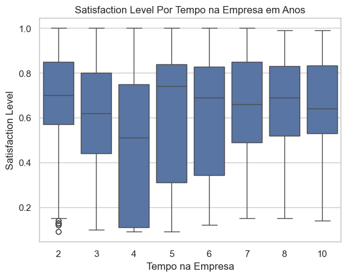
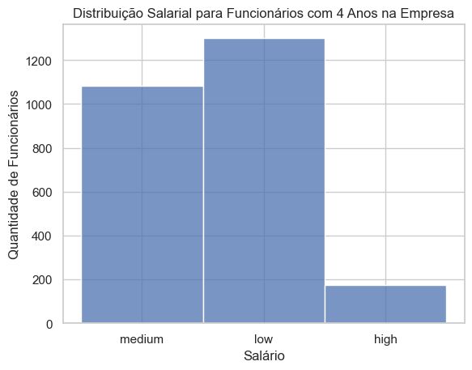
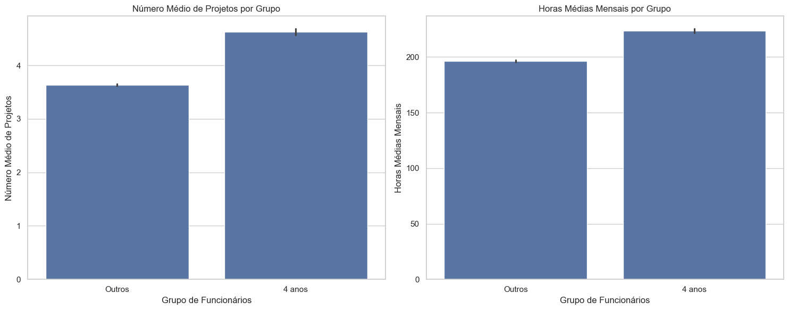
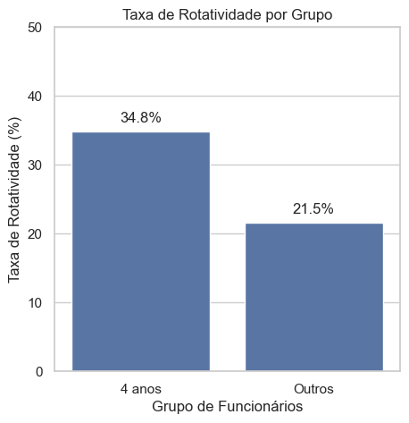

# Análise exploratória e previsão de retenção de Funcionários

Devido à preocupação com a satisfação e a alta rotatividade dos colaboradores, a empresa `Salifort Motors` decidiu realizar uma pesquisa interna. O objetivo é identificar pontos de melhoria no ambiente de trabalho, aumentando a capacidade de prever a retenção de funcionários. Dessa forma, a empresa pode agir preventivamente para evitar desligamentos, reduzindo custos com recrutamento, seleção e treinamento ao longo do tempo.

# Exploração dos dados
- Análise de correlação entre variáveis

Observações:

- O Boxplot acima mostra que pessoas com 4 anos de companhia aparentemente tendem a ter uma variação maior na satisfação em comparação com os demais, então algo está fazendo com que esses colaboradores tenham uma impressão pior.

Pode se perceber que os funcionários que estão há 4 anos na empresa possuem ou possuíam salários baixos ou médios. Isso pode ser um indicativo de que esses funcionários não estão satisfeitos com o salário e isso pode ter influenciado na sua decisão de sair da empresa.

A partir deste gráfico, nota-se que os funcionários com 4 anos de empresa costumam ter um número maior de projetos e horas trabalhadas em relação aos demais. Isso pode indicar maior envolvimento nas atividades, mas também sugere uma possível sobrecarga de trabalho. Considerando ainda os salários mais baixos ou médios desse grupo, é possível que esses colaboradores se sintam desvalorizados ao se compararem com outros, o que pode contribuir para a insatisfação e eventual saída da empresa.

Aqui podemos observar que a taxa de rotatividade dos funcionários com 4 anos de empresa é significativamente maior do que a dos demais funcionários. Isso reforça a ideia de que esses colaboradores estão insatisfeitos com suas condições de trabalho e remuneração, o que pode estar contribuindo para sua decisão de deixar a empresa.# employee-retention
