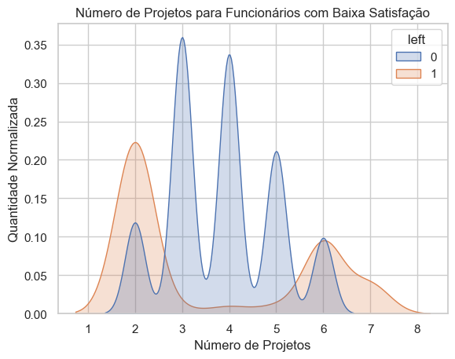
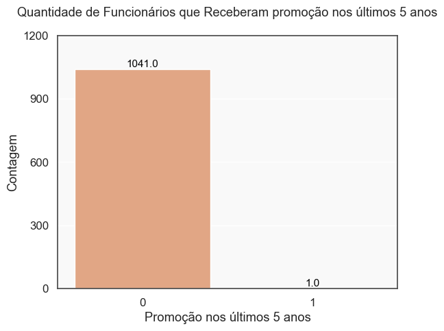
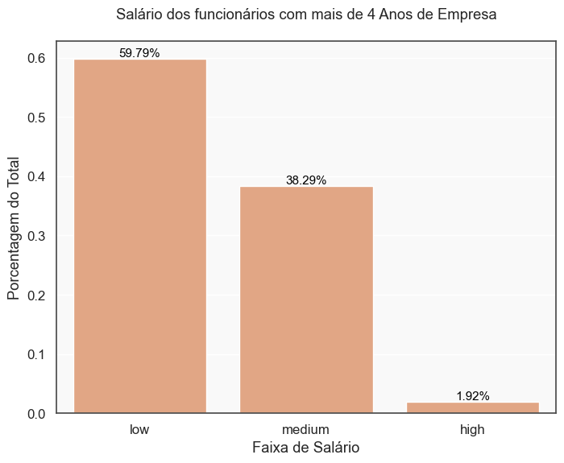

# Resumo Executivo — Retenção de Funcionários na Salifort Motors

## Objetivo

Identificar os principais fatores que levam à saída de funcionários e propor ações práticas para aumentar a retenção, reduzindo custos com desligamentos e promovendo um ambiente de trabalho mais saudável.

## Principais Descobertas

- Funcionários com 4 anos de empresa apresentam maior risco de saída, especialmente por sobrecarga de trabalho e falta de reconhecimento.

 

_Funcionários com 4 anos de empresa se mostraram sair mais do que o restante_

 

- Carga de trabalho inadequada (menos de 3 ou mais de 5 projetos) está fortemente associada à rotatividade.

 

_Funcionários que saíram estão associados com baixa satisfação e com determinado número de projetos (carga de trabalho)_

 

- Falta de promoções e reajustes salariais: Entre os funcionários com mais de 4 anos, quase nenhum recebeu promoção, mesmo com desempenho elevado.

 

_Mesmo com um número "ideal" de projetos, esses funcionários ainda estão saindo e o motivo parece ser a falta de promoção, que acaba gerando sensação de desvalorização._

 

- Salários abaixo do esperado também contribuem para a insatisfação e saída.

 

- 53% dos funcionários ativos apresentam fatores de risco semelhantes aos que já saíram.

## Recomendações

1. Equilibrar a distribuição de projetos: Garantir que cada funcionário tenha entre 3 e 5 projetos.

2. Implementar política clara de promoções e reajustes salariais, especialmente para quem está há mais tempo e apresenta bom desempenho, trazendo mais previsibilidade para a empresa com relação a aumentos no custo com pessoal, e para os funcionários com relação a benefícios em vista, tornando mais óbvio o que precisam fazer para avançarem em seus cargos.

3. Monitorar continuamente os fatores de risco para agir preventivamente, por meio de dashboards executivos e KPIs como:

   - **Taxa de Rotatividade (Turnover Rate):** Percentual de funcionários que deixam a empresa em determinado período.
   - **Nível Médio de Satisfação dos Funcionários:** Média das avaliações de satisfação, acompanhando tendências de queda.
   - **Proporção de Funcionários com Carga de Trabalho Fora da Faixa Ideal:** Percentual de funcionários com menos de 3 ou mais de 5 projetos.
   - **Percentual de Funcionários sem Promoção nos Últimos 5 Anos:**

   - **Tempo Médio sem Promoção:** Média de anos desde a última promoção dos funcionários.
   - **Distribuição Salarial por Tempo de Empresa:** Percentual de funcionários com salários baixos ou médios entre os mais antigos.
   - **Absenteísmo:** Taxa de faltas não justificadas, que pode indicar desmotivação.
   - **Engajamento em Pesquisas Internas:** Percentual de participação em pesquisas de clima ou satisfação.

Esses KPIs permitirão que os gestores de RH possam identificar mais rapidamente possíveis riscos de saídas.

## Impacto Potencial

A adoção das recomendações pode reduzir significativamente a rotatividade, especialmente entre os 53% dos funcionários ativos que apresentam fatores de risco semelhantes aos que já saíram. Isso pode resultar em:

- Redução dos custos com desligamentos, recrutamento e treinamento de novos colaboradores.

- Retenção de talentos experientes, evitando a perda de conhecimento organizacional.

- Melhoria do clima organizacional e do engajamento dos funcionários.

- Aumento da produtividade, já que equipes mais estáveis tendem a 
entregar melhores resultados.

- Fortalecimento da imagem da empresa como um bom lugar para trabalhar, facilitando futuras contratações.

Vale ressaltar que, embora 53% dos funcionários apresentem fatores de risco, nem todos necessariamente sairão. No entanto, atuar preventivamente sobre esse grupo pode trazer ganhos expressivos para a empresa.